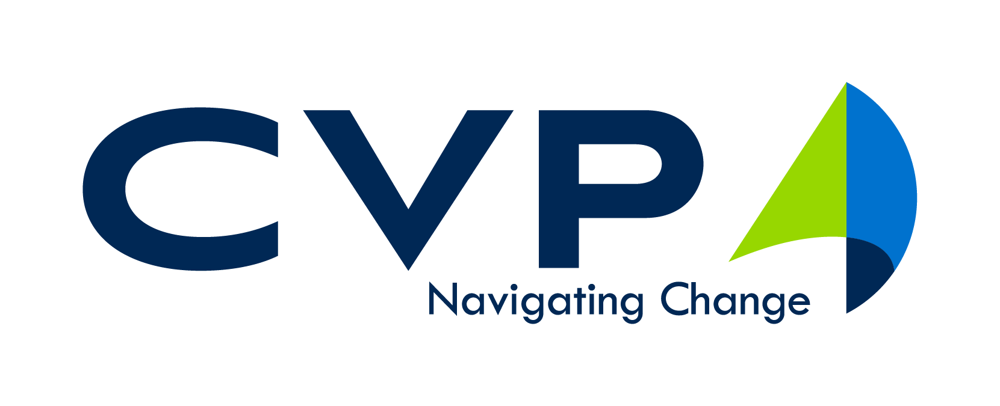

<p align="center">
  <a href="https://www.cvpcorp.com/" target="blank"></a>
</p>

# Container Starter Kit

The purpose of this project is to introduce developers to containers. It demonstrates the use of `Docker Desktop` and how it can increase software developer productivity, quickly and easily containerize applications, and include DevOps as a standard practice from the beginning of a project.

##### This project consists of the following components...
* PostgreSql Database
* ExpressJS API built on NodeJS (uses JavaScript)
* NestJS API built on NodeJS & ExpressJS (uses Typescript)
* React Web Application

Each of the components are built into a docker container using the `Dockerfile.dev` file which specifies the Docker base image to use and the package dependencies to install using `npm`.

The `docker-compose.yml` file configures the containers volumes, port mappings, and service connections for communication with each other.

This project is meant to run on your local device, not a production environment.


## Getting Started

These instructions will get you a copy of the project up and running on your local machine for development and testing purposes.

### Prerequisites

* [Install Docker Desktop](https://www.docker.com/products/docker-desktop)
* Run Docker Desktop

> NOTE: If you have trouble with Docker Desktop, see Troubleshooting for notes on how to resolve common issues.

### Installing

1. Open your terminal and navigate to the directory you wish to store this repository.

2. Clone this repository

    ```shell
    # If using SSH
    git clone git@github.com:CVPcorp/Container_Starter_Kit.git
    
    # If using HTTPS
    git clone https://github.com/CVPcorp/Container_Starter_Kit.git
    ```

3. Navigate to the root project directory

    ```
    cd Container_Starter_Kit
    ```

4. Run docker-compose
    
    ```
    docker-compose up
    ```
    
    The first time you run this command, Docker-Desktop will ask for Filesharing permissions. Allow access to the files requested. 

5. Your program should now be runnning on your docker containers.


## Running

Open a browser and access the following ports:

#### PgAdmin...
* localhost port 80 maps to container port 80
* PgAdmin Login - [http://localhost](http://localhost)

> NOTE: PgAdmin & Database username, password, port information is contained within docker-compose.yml file in root folder

#### React Web Application...
* localhost port 3000 maps to container port 3000
* React Home Page - [http://localhost:3000](http://localhost:3000)
* React Posts Route - [http://localhost:3000/posts](http://localhost:3000/posts)
* React Tasks Route - [http://localhost:3000/tasks](http://localhost:3000/tasks)

#### Posts API...
* localhost port 4000 maps to container port 4000
* Health Check - [http://localhost:4000/api](http://localhost:4000/api)
* Posts Route - [http://localhost:4000/api/posts](http://localhost:4000/api/posts)

#### Tasks API...
* localhost port 5000 maps to container port 5000
* Health Check - [http://localhost:5000/api/ping](http://localhost:5000/api/ping)
* Tasks Route - [http://localhost:5000/api/tasks](http://localhost:5000/api/tasks)
* Swagger UI - [http://localhost:5000/api/swagger](http://localhost:5000/api/swagger)


### Available Scripts

From with the `root` project directory, you can run:

```shell
# This will pull down the base images either from Docker Hub or use the local 
# cache if already pulled previously, build, and run the containers in the background.
docker-compose up

# The `--build` option is the same as `docker-compose up`, however, 
# it will force the containers to be rebuilt in order to capture changes 
# within the docker files.
docker-compose up --build

#This will stop, tear down, & destroy all containers.
docker-compose down
```

## Debugging
There are different ways to debug your containerized application. This document will give a high-level overview of how to debug using Visual Studio Code.

You will need to install the following:
* [VS Code](https://code.visualstudio.com/)
* [Remote - Containers](https://marketplace.visualstudio.com/items?itemName=ms-vscode-remote.remote-containers) (VS Code Extension)
* [Debugger for Chrome](https://marketplace.visualstudio.com/items?itemName=msjsdiag.debugger-for-chrome) (VS Code Extension)  

Make sure Docker is running.

Open the repository in VS Code. The root directory contains a `docker-compose.yml` file. 
* Click `Remote Explorer` from the activity bar.
* Hover over the tab that says `Containers` and click the plus sign.
* Select `Open Current Folder in Container`.
* Select `From docker-compose.yml`.

The application is now running in a container and can be debugged from Chrome. 
* Click the debug tool from the activity bar.
* Select `create a launch.json file`.
* Select `Chrome`.
* In the `launch.json` file, change the `"url"` to `http://localhost:3000`. 
* Select the `Launch Chrome` run button on the top left corner.

`Debugger for Chrome` can now be used for developement. 


## Troubleshooting  

#### Common Issues with Docker:

* Access denied when trying to use Docker commands:
    * Run Docker as administrator. 
    
* Not enough memory to run Docker:
    * It is recommended that you run Docker on a device with at least 16GB of RAM.

## Built With

* [React](https://reactjs.org/) - Front-End UI
* [NestJS](https://nestjs.com/) - Tasks-API
* [Express](https://expressjs.com/) - Posts-API

